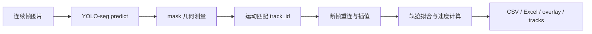

<h1 align="center">铝液滴燃烧 YOLO-seg 连续帧分析工程</h1>

<p align="center">
  
  
  
  
  
</p>

<p align="center">
  
  
</p>

本项目用于分析铝液滴燃烧连续帧图像中的飞溅液滴，输出液滴 mask、中心坐标、面积、圆度、轨迹、速度、断帧补全和轨迹拟合结果。

## 文档入口

| 文档 | 内容 |
| --- | --- |
| [使用文档](docs/usage.md) | 安装、放模型、放数据、运行命令、查看输出、常见操作 |
| [技术文档](docs/technical.md) | 项目架构、算法流程、参数逻辑、轨迹拟合、部署方案 |
| [预处理建议](docs/image_preprocessing_recommendations.md) | ROI 裁剪、灰度、CLAHE、去噪、光晕干扰处理 |

## 功能标签

<p>
  
  
  
  
  
  
</p>

## 快速运行

安装依赖：

```bash
pip install -r requirements.txt
```

放置模型：

```text
weights/best.pt
```

放置数据：

```text
data/组1/
data/组2/
data/组3/
```

运行默认配置：

```bash
python src/run_pipeline.py
```

指定某一组：

```bash
python src/run_pipeline.py --images "data/组2" --output "output/组2"
```

输出示例：

```text
output/组2/run1.0/
  result.csv
  result.xlsx
  summary.csv
  overlay/
  tracks.png
```

## 技术流程



## 输出概览

| 文件 | 作用 |
| --- | --- |
| `result.csv` | 每帧每个液滴的完整参数，适合后续程序分析 |
| `result.xlsx` | Excel 结果，适合人工检查 |
| `summary.csv` | 每条轨迹的质量汇总，适合筛选异常轨迹 |
| `overlay/` | 每张图的分割轮廓、中心点、ID 叠加结果 |
| `tracks.png` | 所有轨迹汇总图，彩色为轨迹，白色为拟合线 |

## 推荐阅读顺序

1. 第一次运行：先看 [使用文档](docs/usage.md)
2. 调参数和部署：看 [技术文档](docs/technical.md)
3. 处理漏检、光晕、弱液滴：看 [预处理建议](docs/image_preprocessing_recommendations.md)
